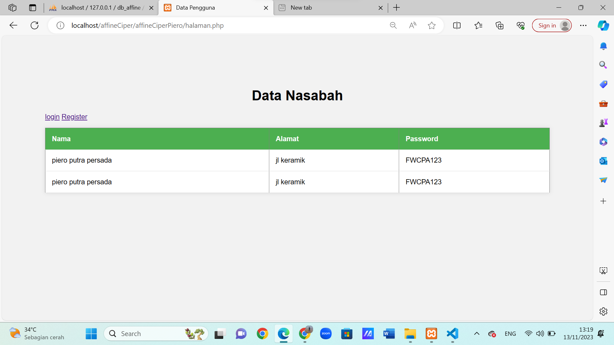

# Affine Cipher

### Nama :Piero Putra Persada
### NIM :312110036
### Kelas :TI.21.A1
---

### Pengenalan Affine Cipher

Affine Cipher adalah jenis enkripsi substitusi yang menggabungkan penggeseran (shift) dan transformasi linear pada teks terbuka. key1 adalah penggabungan dari penggeseran dan transformasi linear, sementara key2 adalah nilai penggeseran. Dengan menggunakan dua kunci ini, teks dapat dienkripsi dan didekripsi dengan metode Affine Cipher.

### Enkrpsi

Yang akan di enkripsi adalah password yang anda masukan di form registrasi 

[function Encrypt dan Decrypt](https://github.com/Rizalpringgandani/Uts_Kripto_Piero/blob/main/affineCiperPiero/encrypt_decrypt.php)

1. Setiap karakter dalam plaintext diubah menjadi huruf besar dengan strtoupper.
2. Kemudian, dilakukan pemeriksaan apakah karakter tersebut adalah huruf alfabet menggunakan ctype_alpha.
3. Jika karakter adalah huruf alfabet, maka karakter tersebut diubah menjadi nilai numerik yang sesuai (A=0, B=1, ..., Z=25).
4. Kemudian, formula enkripsi Affine Cipher diterapkan pada nilai numerik tersebut. Formula ini adalah (key1 * numericValue + key2) % 26, di mana key1 dan key2 adalah kunci enkripsi.
5. Hasil dari rumus enkripsi digunakan untuk mengembalikan huruf alfabet yang sesuai dan diappend ke dalam hasil enkripsi.
6. Jika karakter bukan huruf alfabet, maka karakter tersebut dibiarkan tidak berubah dalam hasil enkripsi

Hasil Entripsi tersebut lalu di kirim ke database 

### Dekripsi

Password yang telah di enkripsi di ambil dari databse lalu di dekripsi agar bisa di gunakan untuk login

1. Fungsi decrypt melakukan kebalikan dari fungsi encrypt. Pertama, ia menghitung modulus invers dari key1 terhadap 26 untuk mendapatkan modInverse. Ini digunakan dalam proses dekripsi.
2. Kemudian, karakter ciphertext diubah menjadi huruf besar dan diperiksa apakah karakter tersebut adalah huruf alfabet.
3. Jika karakter adalah huruf alfabet, maka proses dekripsi Affine Cipher diterapkan. Rumus dekripsi adalah modInverse * (numericValue - key2 + 26) % 26.
4. Hasil dekripsi digunakan untuk mengembalikan huruf alfabet yang sesuai dan diappend ke dalam hasil dekripsi.
5. Jika karakter bukan huruf alfabet, karakter tersebut dibiarkan tidak berubah dalam hasil dekripsi.

### Form Register

### Form Login

### Output 

